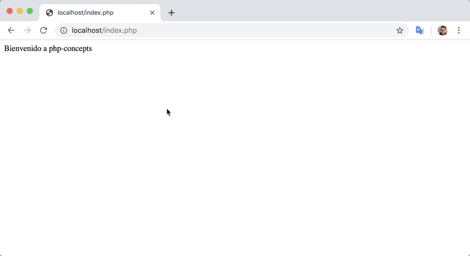

# php-concepts
Este repositorio contiene diversos ejemplos que permiten revisar ciertos conceptos.

# ¿Cómo usar con Docker?

## Instalar Docker

Si no tienes instalado docker, revisar la [documentación de Docker](https://docs.docker.com/get-started/) para instalar y usar. 

## Ejecutar con docker

Se utiliza una imagen creada por [mattrayner](https://hub.docker.com/r/mattrayner/lamp) que contiene Lamp (php+mysql+phpmyadmin). 

Estando en el directorio que contiene al archivo Dockerfile, ejecutar:

~~~
docker run -p "80:80" -v ${PWD}:/app mattrayner/lamp:latest-1804
~~~

Aparecerán mensajes como siguen:

~~~
sed: can't read /etc/php/7.2/apache2/php.ini: No such file or directory
rm: cannot remove '/var/run/mysqld/mysqld.sock': No such file or directory
=> An empty or uninitialized MySQL volume is detected in /var/lib/mysql
=> Installing MySQL ...
=> Done!
=> Waiting for confirmation of MySQL service startup
=> Creating MySQL admin user with random password
ERROR 1133 (42000) at line 1: Can't find any matching row in the user table
=> Done!
========================================================================
You can now connect to this MySQL Server with hRkafcN1qvR2

    mysql -uadmin -phRkafcN1qvR2 -h<host> -P<port>

Please remember to change the above password as soon as possible!
MySQL user 'root' has no password but only allows local connections

enjoy!
========================================================================
/usr/lib/python2.7/dist-packages/supervisor/options.py:297: UserWarning: Supervisord is running as root and it is searching for its configuration file in default locations (including its current working directory); you probably want to specify a "-c" argument specifying an absolute path to a configuration file for improved security.
  'Supervisord is running as root and it is searching '
2019-06-05 13:22:14,747 CRIT Supervisor running as root (no user in config file)
2019-06-05 13:22:14,748 WARN Included extra file "/etc/supervisor/conf.d/supervisord-apache2.conf" during parsing
2019-06-05 13:22:14,748 WARN Included extra file "/etc/supervisor/conf.d/supervisord-mysqld.conf" during parsing
2019-06-05 13:22:14,762 INFO RPC interface 'supervisor' initialized
2019-06-05 13:22:14,762 CRIT Server 'unix_http_server' running without any HTTP authentication checking
2019-06-05 13:22:14,763 INFO supervisord started with pid 1
2019-06-05 13:22:15,767 INFO spawned: 'mysqld' with pid 502
2019-06-05 13:22:15,770 INFO spawned: 'apache2' with pid 503
2019-06-05 13:22:17,066 INFO success: mysqld entered RUNNING state, process has stayed up for > than 1 seconds (startsecs)
2019-06-05 13:22:17,067 INFO success: apache2 entered RUNNING state, process has stayed up for > than 1 seconds (startsecs)
~~~

Abrir un navegador e ingresar:

http://localhost/index.php

Como la imagen docker contiene **phpmyqdmin**, en los mensajes de salidas se incluye información sobre el _user_ y _password_ para ingresar a phpmyadmin. Revisar estos mensajes cada vez que se ejecute la imagen, pues la _password_ cambia. 

Ej:

~~~~
=> Done!
========================================================================
You can now connect to this MySQL Server with hRkafcN1qvR2

    mysql -uadmin -phRkafcN1qvR2 -h<host> -P<port>

Please remember to change the above password as soon as possible!
MySQL user 'root' has no password but only allows local connections

enjoy!
========================================================================
~~~~

